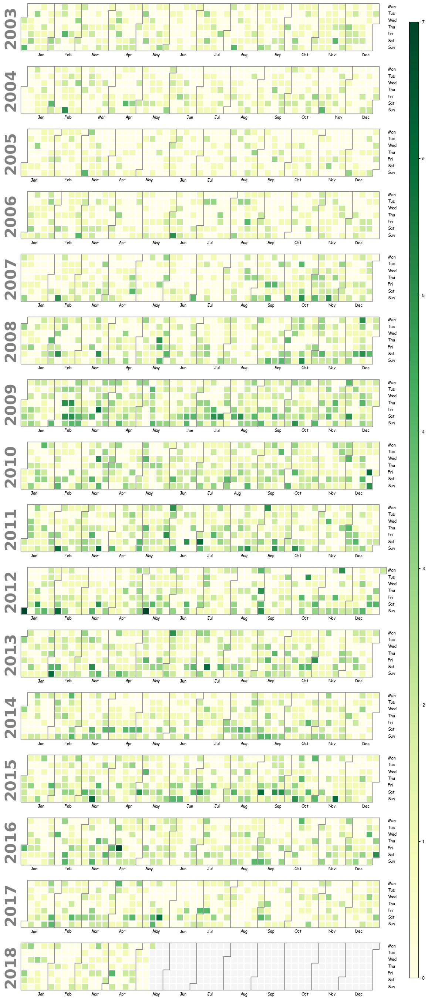
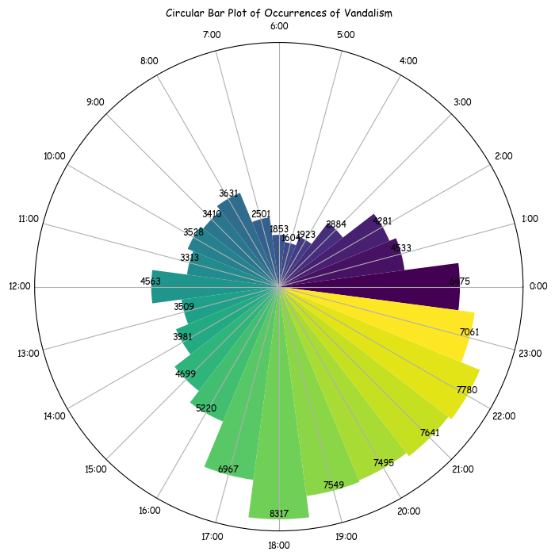

# Unveiling Urban Trends: Data Analytics Illuminate Crime Records in San Francisco

## Introduction

Blabla bla

## Visualizations

*Caption: Description for driving under influence*

*Caption: Description for crimes in general*

*Caption: Description for crimes of vandalism*

*Caption: Description for Map*

## Gifs

## Text with bulletpoints

- Bullet point 1

- Bullet point 2

- Bullet point 3

## Links

- [SF Police Department - Crime Dashboard](https://www.sanfranciscopolice.org/stay-safe/crime-data/crime-dashboard)

- [Violent Crime and Property Crime](https://sfgov.org/scorecards/public-safety/violent-crime-rate-and-property-crime-rate)

- [CNN Article](https://edition.cnn.com/2023/05/03/politics/san-francisco-crime-rate-what-matters/index.html)

## Citation
[Doe, J. (2020). The Importance of Lorem Ipsum.)^1]

## Text with citation
Lorem ipsum dolor sit amet, consectetur adipiscing elit. Ut et lorem in neque tincidunt gravida sit amet id nulla [^1].

