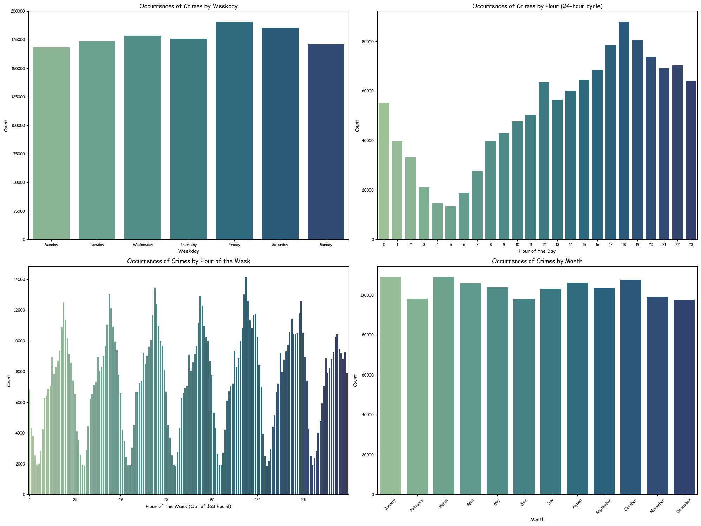
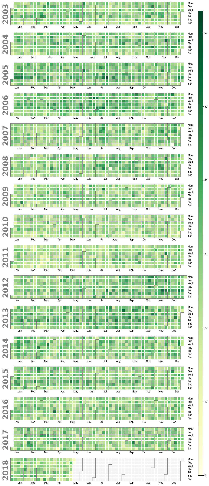
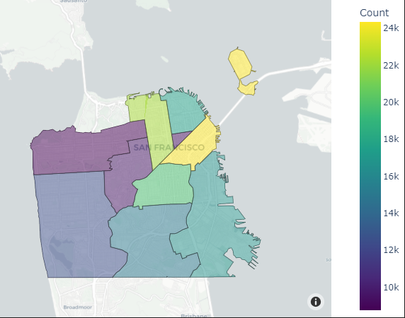

# Unveiling Urban Trends: Data Analytics Illuminate Crime Records in San Francisco

## Introduction

In this article, we delve into the crime trends in San Francisco District, utilizing data sourced from Police Department Incident Reports: Historical 2003 to May 2018 [Dataset](https://data.sfgov.org/Public-Safety/Police-Department-Incident-Reports-Historical-2003/tmnf-yvry/about_data). Our focus is on key categories of crimes including robbery, burglary and stolen property. By analyzing these three categories, we aim to provide insights into the prevailing crime landscape in the district.

- **Robbery:**
Robbery, under the law of San Francisco city, is defined as the unlawful taking of property from a person through force or threat of force. This category encompasses crimes where individuals are directly targeted and subjected to violence or intimidation to relinquish their belongings.

- **Burglary:**
Burglary involves the unlawful entry into a building or structure with the intent to commit theft or another felony. Within the context of San Francisco's legal framework, burglary captures instances of unauthorized access to properties, residences, or commercial establishments for illicit purposes.

- **Stolen Property:**
Stolen property offenses involve the possession, receipt, or sale of items obtained through criminal means. This category covers instances where individuals are found to be in possession of stolen goods or engaged in the trafficking of stolen merchandise.

## Visualizations

*Caption: Crimes and Time Patterns*

*Caption: Calendar plot*

*Caption: Crime map*

## Conclusion:

By categorizing crimes under these distinct umbrellas, we gain a clearer understanding of the prevalent criminal activities within San Francisco District. Through data analysis and visualization, we aim to shed light on the dynamics of these crime trends, ultimately contributing to efforts aimed at enhancing public safety and security in the community.

In San Francisco, several factors contribute to the occurrence of criminal records. Economic disparities, poverty, and limited access to resources can lead individuals to resort to crime out of necessity. Substance abuse issues, including drug addiction and alcoholism, can impair judgment and drive individuals towards illegal activities. The city's homelessness crisis further exacerbates vulnerabilities, increasing the likelihood of involvement in criminal behavior. Untreated mental health conditions also play a role, with individuals facing challenges in accessing necessary treatment and support services. Additionally, neighborhood characteristics, such as social disorganization and exposure to violence, influence crime rates. Gang activity and systemic issues, including structural inequalities and racial disparities within the criminal justice system, further compound the problem. Understanding these underlying factors is crucial for developing effective strategies to address crime and promote community safety in San Francisco.

## Useful Links

- [SF Police Department - Crime Dashboard](https://www.sanfranciscopolice.org/stay-safe/crime-data/crime-dashboard)

- [Violent Crime and Property Crime](https://sfgov.org/scorecards/public-safety/violent-crime-rate-and-property-crime-rate)

- [CNN Article](https://edition.cnn.com/2023/05/03/politics/san-francisco-crime-rate-what-matters/index.html)
